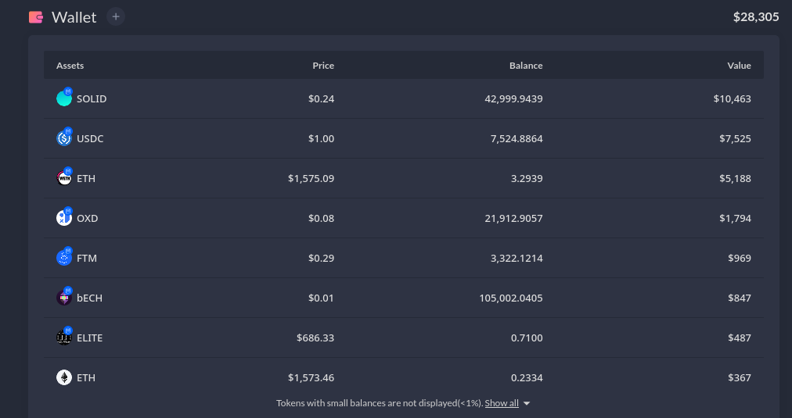

---

title: 2022/08/18
parent: 👑 Treasury
has_children:
nav_order:

---

# 2022/08/18

| ------------------- | ---------- |
| Asset Category      |  Valuation |
| ------------------- | ---------- |
| Class A Assets      |    $30,000 |
| Class B Assets      |    $24,000 |
| Class C Assets      |         $0 |
| ------------------- | ---------- |
| Net-Asset Valuation |    $54,000 |
| ------------------- | ---------- |
| Price of ELITE in $ |     $2,619 |
| ------------------- | ---------- |

---

Raw data as taken from Discord

{ .highlight }
This includes ELITE/FTM LP, but we need to reduce the ELITE side of it.

{ .highlight }
Looks like we had 10 ELITE in LP, so reduce 25k
And we held 10 in wallet, so another -25k

[9:34 AM]
:
anyways, here is the current treasury breakdown:
(as of 2022-8-18)

$90,572 on Fantom
$8,087 on Echelon
$804 on MultiVAC
$438 on Ethereum
$270 on Metis
$203 on BSC
$85 on KCC
$45 on Polygon
$8 on Avalanche
$4 as native BCH
- - - - - - - - - -
$100,516 in total
- - - - - - - - - -

